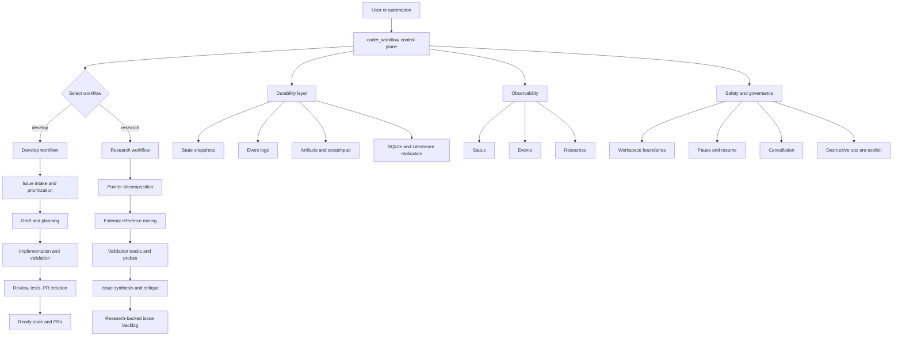

# coder

Orchestrates a multi-agent workflow using `gemini` + `claude` + `codex`.

This tool is designed for a workspace folder that contains one or more git repositories as subfolders.

## Prerequisites

- Node.js >= 20
- `gemini`, `claude` (Claude Code), and `codex` CLIs installed and authenticated on your machine
- No external tool installs required — plan review and commit hygiene checks are built in

## Usage

Install globally (once published):

```bash
npm install -g <published-package-name>
```

Install from source:

```bash
cd coder
npm install
npm link
```

Then run from the workspace folder that contains your project repositories:

```bash
coder
```

Run MCP server in HTTP mode (single long-running daemon endpoint):

```bash
coder-mcp --transport http --host 127.0.0.1 --port 8787 --path /mcp
```

Optional:

```bash
# Prompt for issue selection (instead of auto-picking Gemini's recommendation)
coder --interactive
```

You can also run from anywhere and point at a workspace:

```bash
coder --workspace /path/to/workspace
```

If the repo's test command can't be auto-detected, pass one explicitly:

```bash
coder --test-cmd "pnpm test"
```

### `coder ppcommit`

Run ppcommit checks on all files in the repository:

```bash
coder ppcommit
```

To check only files changed since a specific branch (PR-scope review):

```bash
coder ppcommit --base main
```

By default, `coder` will:

1. Ask Gemini to list issues assigned to you (via MCPs) and recommend the easiest.
2. Ask you 3 questions to clarify the chosen issue.
3. Write `.coder/artifacts/ISSUE.md` in the workspace.
4. Ask Claude Code to write `.coder/artifacts/PLAN.md` in the workspace.
5. Run built-in plan review (Gemini) and save critique to `.coder/artifacts/PLANREVIEW.md`.
6. Ask Claude Code to update the plan and implement the feature.
7. Ask Codex CLI to run built-in ppcommit checks, fix issues, and run tests (no bypasses). Then `coder` updates `.coder/artifacts/ISSUE.md` with completion status (no redundant final agent pass).

### Idea -> Issue Backlog (Pointers)

When you don't have a pre-existing GitHub/Linear issue and only have raw pointers, use MCP tool `coder_generate_issues_from_pointers`.

- Inputs: `repoPath`, `pointers`, optional `clarifications`, `iterations`, `maxIssues`
- Controls:
  - `webResearch` (default `true`): mine GitHub + Show HN references
  - `validateIdeas` (default `true`): validate bug/direction before final issue emission
  - `validationMode`: `auto` | `bug_repro` | `poc`
- Output: researched issue drafts + manifest + pipeline state under `.coder/scratchpad/<run-id>/`
- Independent pipeline steps are tracked in `pipeline.json` (chunk analysis, reference mining, validation planning, validation execution, issue synthesis/review)
- Iteration artifacts stay in `.coder/scratchpad/` (not `issues/`)
- Then pick one generated issue and run the normal workflow (`coder_draft_issue` -> `coder_create_plan` -> ...)

## Notes

- `coder` uses a host sandbox provider: commands run on your machine (so MCP/config works), and changes land in a dedicated git worktree under `.coder/worktrees/`.
- Feature branches are semantic by default: `<type>/<up-to-4-words>_<GH|LN>_<issue-id>` (example: `feat/add-health-check_GH_123`).
- On Linux, `coder` prefers `systemd-run --user` for command execution (cgroup lifecycle + `KillMode=control-group`) and falls back to direct host execution if unavailable. Set `CODER_DISABLE_SYSTEMD_RUN=1` to force fallback, or `CODER_FORCE_SYSTEMD_RUN=1` to force systemd mode.
- Plan review uses Gemini CLI with search grounding to verify external API documentation.
- The workflow files live under `.coder/artifacts/` by default (`ISSUE.md`, `PLAN.md`, `PLANREVIEW.md`).
- Iterative research notes and idea-to-issue artifacts live under `.coder/scratchpad/`.
- WIP durability: after major workflow steps, coder can auto-commit/push checkpoint commits (`chore(wip): checkpoint ... [skip ci]`) to the current branch.
- Scratchpad durability: `.coder/scratchpad/*` can be mirrored into SQLite (`.coder/state.db`) for local persistence/restore workflows (`sqlite3` CLI required; auto-disables if unavailable).
- Progress + logs are written under `.coder/` (see `.coder/state.json` and `.coder/logs/*.jsonl`).
- Workflow control state is modeled with XState and checkpointed to `.coder/workflow-state.json` (mirrored to SQLite when enabled).
- Repo includes examples for local tool config: `.mcp.example.json`, `.claude/settings.example.json`, and `coder.example.json`.
- Security model: this project orchestrates LLM agents that run shell commands. You should run it in an isolated environment (VM/container/throwaway devbox) with minimal credentials and no sensitive data. Hardening that environment is out of scope for this project.
- MCP workspace safety: tool calls are constrained to paths under the server startup directory by default. Set `CODER_ALLOW_ANY_WORKSPACE=1` to allow arbitrary workspace paths.
- Test health-check safety: URLs must target localhost by default. Set `CODER_ALLOW_EXTERNAL_HEALTHCHECK=1` to allow external health-check endpoints.
- Claude Code permissions: by default, `coder` passes `--dangerously-skip-permissions` to Claude Code. To force permission prompts, use `--claude-require-permissions` or set `CODER_CLAUDE_DANGEROUS=0`.
- Agent roles are configurable in `coder.json`:
  - `workflow.agentRoles.issueSelector`
  - `workflow.agentRoles.planner`
  - `workflow.agentRoles.planReviewer`
  - `workflow.agentRoles.programmer`
  - `workflow.agentRoles.reviewer`
  - `workflow.agentRoles.committer`
  Valid values: `"gemini" | "claude" | "codex"`.

Example:
```json
{
  "workflow": {
    "agentRoles": {
      "issueSelector": "gemini",
      "planner": "claude",
      "planReviewer": "gemini",
      "programmer": "claude",
      "reviewer": "codex",
      "committer": "codex"
    },
    "wip": {
      "push": true,
      "autoCommit": true,
      "includeUntracked": false,
      "remote": "origin"
    },
    "scratchpad": {
      "sqliteSync": true,
      "sqlitePath": ".coder/state.db"
    }
  }
}
```

## Litestream Bootstrap

Use Litestream to continuously replicate `.coder/state.db` (scratchpad/state durability) to remote object storage.

1. Install the durability service with `coder` (system scope):

```bash
coder durability install \
  --scope system \
  --workspace /absolute/path/to/workspace \
  --host 127.0.0.1 \
  --port 8787 \
  --path /mcp \
  --replica-url "s3://your-private-bucket/coder/state"
```

2. Manage the service:

```bash
coder durability status --scope system --workspace /absolute/path/to/workspace
coder durability logs --scope system --workspace /absolute/path/to/workspace --follow
coder durability restart --scope system --workspace /absolute/path/to/workspace
```

For user-level services, swap `--scope system` with `--scope user`.

3. Manual bootstrap (if you prefer editing files directly):

```bash
cp litestream.example.yml litestream.yml
export LITESTREAM_REPLICA_URL="s3://your-private-bucket/coder/state"
npm run coder:mcp:durable
```

Useful commands:

```bash
# one-time restore only
npm run litestream:restore

# replication loop only (run in separate terminal if needed)
npm run litestream:replicate
```

Notes:
- `coder:mcp:durable` runs `coder-mcp` under `litestream replicate -exec ...` after restore.
- `coder durability install` creates/updates:
  - `litestream.yml`
  - `.coder/litestream.env`
  - a deterministic systemd unit for that workspace.
- For encrypted cloud backups, use provider-side encryption at rest (for example, private bucket + KMS-managed keys).

## Workflow Control Plane

Use `coder_workflow` as the unified workflow tool:
- `action: "start"` + `workflow: "develop"` launches the autonomous develop loop
- `action: "start"` + `workflow: "research"` launches pointer-to-issue research backlog generation
- `action: "status" | "events" | "pause" | "resume" | "cancel"` controls/observes runs
- Both workflows use an explicit XState lifecycle machine (`idle -> running -> paused/cancelling -> completed|failed|cancelled`) for durable, inspectable transitions.
- `develop` events are logged to `.coder/logs/develop.jsonl`.
- `research` events are logged to `.coder/logs/research.jsonl`.

`ppcommit` LLM settings (OpenAI-compatible API):
```json
{
  "ppcommit": {
    "enableLlm": true,
    "llmServiceUrl": "https://generativelanguage.googleapis.com/v1beta/openai",
    "llmApiKey": "",
    "llmApiKeyEnv": "GEMINI_API_KEY",
    "llmModel": "gemini-3-flash-preview"
  }
}
```
API key resolution order:
1. `ppcommit.llmApiKey`
2. env var named by `ppcommit.llmApiKeyEnv`
3. `OPENAI_API_KEY`
4. `GEMINI_API_KEY`
5. `GOOGLE_API_KEY`

## MCP Develop Mode

When running as an MCP server (`coder-mcp`), use `coder_workflow` with `workflow: "develop"` for unattended batch execution.

- `coder_workflow` (`develop`) checkpoints progress in `.coder/loop-state.json`.
- `coder://loop-state` exposes the live queue/results for monitoring.
- Resume behavior is crash-safe: rerunning `coder_workflow` (`develop`) resumes from the next unfinished issue.
- Dependency-aware stacked mode is enabled: if issue `B` depends on `A`, `B` is drafted on top of `A`'s branch and its PR is created with `--base <A-branch>`.
- Safe reset is default: repo cleanup between issues does not discard local changes unless `destructiveReset: true` is explicitly set.
- `destructiveReset: true` checks out the repo's default branch between issues and runs `git restore`/`git clean`. If your `testCmd` assumes files that only exist on an unmerged feature branch (e.g. `Cargo.toml` only added in a previous PR), tests will fail due to missing infrastructure. In this case, either merge the prerequisite branch, stack dependent issues via dependencies, or adjust your configured test command.

## Architecture and concepts

`coder` is modeled as an orchestration system with one control-plane tool (`coder_workflow`) and two workflow domains:



- `develop`: executes assigned issues end-to-end (list -> draft -> plan -> implement -> review/test -> PR).
- `research`: turns free-form pointers into validated, reference-grounded issue drafts.

Core concepts:

- Workflow machine:
  - Both workflows are represented with explicit XState lifecycle states (`idle`, `running`, `paused`, `cancelling`, terminal states).
  - This keeps state transitions explicit and auditable instead of implicit flags.
- Run ownership and concurrency:
  - Only one active workflow run is allowed per workspace.
  - Run IDs are short-lived identifiers used for status/events/control actions.
- Durable state model:
  - Operational state is persisted under `.coder/` (`state.json`, `loop-state.json`, `research-state.json`, `workflow-state.json`).
  - Scratchpad and state can be mirrored to SQLite (`.coder/state.db`) and replicated with Litestream.
- Artifact model:
  - Workflow artifacts live in `.coder/artifacts/` (`ISSUE.md`, `PLAN.md`, `PLANREVIEW.md`).
  - Research iteration artifacts live in `.coder/scratchpad/` (manifests, pipeline checkpoints, generated issue drafts).
- Event model:
  - Structured workflow events are append-only JSONL logs:
    - `.coder/logs/develop.jsonl`
    - `.coder/logs/research.jsonl`
  - `coder_workflow` `events` reads these logs using cursor-style pagination.
- Execution model:
  - `CoderOrchestrator` executes stage logic with explicit pause/cancel checkpoints.
  - Agent roles (`issueSelector`, `planner`, `programmer`, etc.) are policy/config, not hard-coded behavior.
- Safety model:
  - Workspace boundary checks, health-check URL restrictions, and non-destructive reset defaults are enforced by default.
  - Destructive operations are explicit opt-in.

In short: `coder_workflow` is the control plane, `develop` and `research` are workflow state machines, and `.coder/` is the durable source of truth for orchestration state, events, and artifacts.

## Contributing

See [CONTRIBUTING.md](CONTRIBUTING.md).

## Security

See [SECURITY.md](SECURITY.md).

## License

See [LICENSE](LICENSE).
