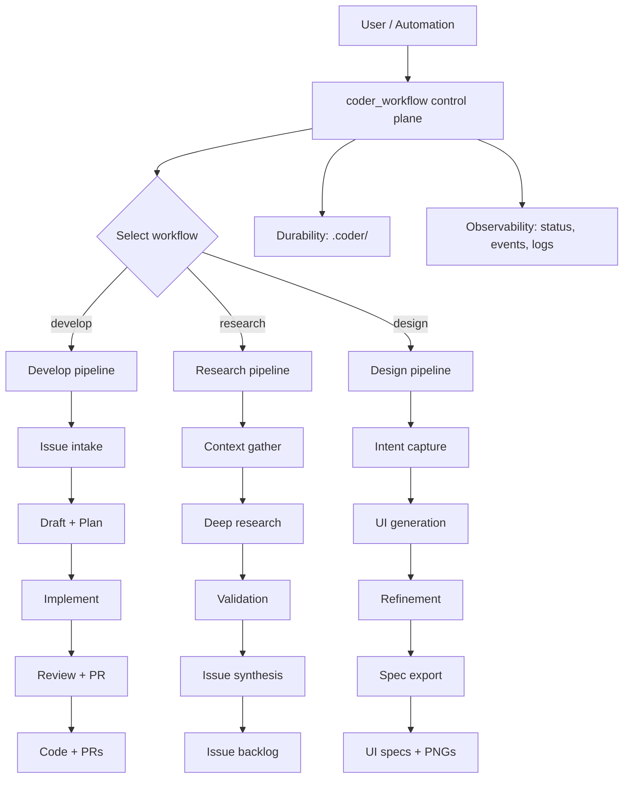

# coder

Multi-agent MCP server orchestrating `gemini` + `claude` + `codex` across three composable workflows: **Develop**, **Research**, and **Design**.

## Prerequisites

- Node.js >= 20
- `gemini`, `claude` (Claude Code), and `codex` CLIs installed and authenticated
- Optional: Google Stitch MCP server for the Design workflow

## Install

```bash
cd coder
npm install
npm link
```

## MCP Server

The primary interface is the MCP server (`coder-mcp`):

```bash
# stdio (default — used by Claude Code, Cursor, etc.)
coder-mcp

# HTTP (long-running daemon)
coder-mcp --transport http --host 127.0.0.1 --port 8787 --path /mcp
```

## CLI

The `coder` CLI is for management only:

```bash
coder status              # Show workflow state
coder config              # Show resolved config
coder ppcommit            # Run commit hygiene checks
coder ppcommit --base main  # PR-scope check
coder serve               # Start HTTP MCP server
```

## Three Workflows

### Develop

Consumes GitHub/Linear issues, implements code, pushes PRs:

```
issue-list → issue-draft → planning → plan-review → implementation → quality-review → pr-creation
```

Start via MCP: `coder_workflow { action: "start", workflow: "develop" }`

### Research

Turns free-form ideas into validated, reference-grounded issue backlogs:

```
context-gather → deep-research → tech-selection → poc-validation → issue-synthesis → issue-critique → spec-publish
```

Start via MCP: `coder_workflow { action: "start", workflow: "research", pointers: "..." }`

### Design

Generates UI designs from intent descriptions via Google Stitch:

```
intent-capture → ui-generation → ui-refinement → spec-export
```

Start via MCP: `coder_workflow { action: "start", workflow: "design", designIntent: "..." }`

Outputs: `/spec/UI/{screen-name}.png` + `/spec/UI/{screen-name}.md`

## Machine Architecture

Every workflow step is a **machine** — an atomic, independently callable unit:

```
defineMachine({ name, description, inputSchema, execute, mcpAnnotations })
```

Each machine is automatically registered as an MCP tool (`coder_develop_planning`, `coder_research_context_gather`, etc.) AND composable into workflow pipelines via `WorkflowRunner`.

```
src/machines/
  develop/     # 7 machines
  research/    # 7 machines
  design/      # 4 machines
  shared/      # 2 reusable machines (web-research, poc-runner)
```

## Agent Layer

Three agent backends:

| Mode | Backend | Use Case |
|------|---------|----------|
| `cli` | `CliAgent` (shell) | Complex tasks: planning, implementation, review |
| `api` | `ApiAgent` (HTTP) | Simple tasks: classification, JSON extraction, scoring |
| `mcp` | `McpAgent` (MCP SDK) | External MCP servers (Stitch) |

`AgentPool.getAgent(role, { scope, mode })` manages agent lifecycle and caching.

## Workflow Control Plane

`coder_workflow` is the unified control tool:

| Action | Description |
|--------|-------------|
| `start` | Launch a workflow (develop/research/design) |
| `status` | Check current run state |
| `events` | Read event log with cursor pagination |
| `pause` | Pause at next checkpoint |
| `resume` | Resume paused run |
| `cancel` | Cancel active run |

XState v5 models the workflow lifecycle: `idle → running → paused/cancelling → completed/failed/cancelled`.

## Configuration

`coder.json` in workspace root or `~/.config/coder/config.json`:

```json
{
  "workflow": {
    "agentRoles": {
      "issueSelector": "gemini",
      "planner": "claude",
      "planReviewer": "gemini",
      "programmer": "claude",
      "reviewer": "codex",
      "committer": "codex"
    },
    "wip": { "push": true, "autoCommit": true },
    "scratchpad": { "sqliteSync": true }
  },
  "design": {
    "stitch": { "enabled": true, "serverCommand": "npx stitch-mcp" },
    "specDir": "spec/UI"
  },
  "github": {
    "epicAsMilestone": true,
    "defaultLabels": ["coder"]
  },
  "agents": {
    "preferApi": false,
    "geminiApiEndpoint": "https://generativelanguage.googleapis.com/v1beta",
    "anthropicApiEndpoint": "https://api.anthropic.com"
  }
}
```

## GitHub Integration

The research workflow's `spec-publish` machine can push issues to GitHub:
- Creates milestones (Epics) via `gh api`
- Topologically sorts issues by dependencies
- Creates issues with labels and milestone assignment
- Adds "Depends on #N" cross-references

## State and Durability

All state lives under `.coder/`:

| File | Purpose |
|------|---------|
| `state.json` | Per-issue workflow state |
| `loop-state.json` | Multi-issue develop loop state |
| `workflow-state.json` | XState lifecycle snapshot |
| `artifacts/` | `ISSUE.md`, `PLAN.md`, `PLANREVIEW.md` |
| `scratchpad/` | Research artifacts, pipeline checkpoints |
| `logs/*.jsonl` | Structured event logs |
| `state.db` | Optional SQLite mirror |

## ppcommit

Built-in commit hygiene checks (tree-sitter AST-based):
- Blocks: secrets, TODOs, LLM markers, narration comments, emojis in code, magic numbers, placeholder code, compat hacks, over-engineering
- `coder ppcommit` or `coder ppcommit --base main`

## Safety

- Workspace boundaries enforced by default
- Non-destructive reset between issues (opt-in `destructiveReset: true`)
- Health-check URLs restricted to localhost
- One active run per workspace
- `CODER_ALLOW_ANY_WORKSPACE=1` to allow arbitrary paths
- `CODER_ALLOW_EXTERNAL_HEALTHCHECK=1` for external health-check URLs

## Architecture



## Contributing

See [CONTRIBUTING.md](CONTRIBUTING.md).

## License

See [LICENSE](LICENSE).
